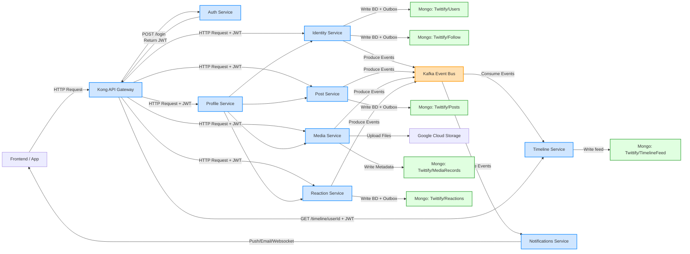
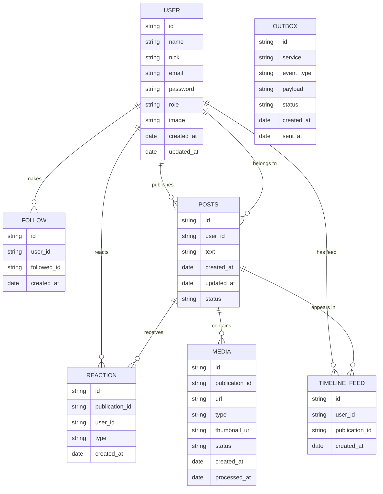

# Twittify

A Twitter-like social media application built with Node.js, Express.js, and MongoDB, following a microservices architecture.

## Project Description

Twittify is a social media platform that allows users to share short messages, follow other users, and interact through likes and reactions. The application is built using a microservices architecture with **CQRS pattern implementation** to ensure scalability, maintainability, and independent service deployment.

The system leverages an **event-driven architecture** using Kafka as the message broker, implementing the **Outbox pattern** to guarantee reliable event publishing. The architecture separates write operations (handled by individual services) from read operations (optimized through materialized views in the Timeline Service), providing excellent performance and scalability characteristics.

**Authentication** is handled by a dedicated **Auth Service**, which issues and validates JWT tokens independently, keeping security concerns separate from the frontend and the rest of the services.

### Frontend

* Web / Mobile App

  * User interface.
  * Makes HTTP requests to the **API Gateway**.
  * Uses JWT for authenticated requests.
  * WebSocket subscriptions for notifications (optional).

### API Gateway

* Kong API Gateway

  * Single entry point.
  * Routes requests to services.
  * JWT authentication (delegated to **Auth Service**).
  * Rate limiting.
  * Request routing:

    * Login/authentication → Auth Service.
    * Simple requests → individual services (`Identity`, `Post`, `Media`, `Reaction`).
    * Complex queries → BFF / Profile Service.
    * Timeline reads (`GET /timeline/{userId}`) → Timeline Service.

### Auth Service

* Handles user login, token refresh, and logout.
* Endpoints:

  * `POST /login` → generates JWT.
  * `POST /refresh-token` → refreshes JWT.
  * `POST /logout` → invalidates session/token.
* Optional MongoDB storage for revoked tokens or sessions.
* Does **not** use Outbox or events by default.

### BFF / Profile Service

* Backend for Frontend for complex queries.
* Orchestrates data from multiple services:

  * Identity Service → user data.
  * Post Service → publications.
  * Media Service → related media.
  * Reaction Service → likes and reactions.
* Returns a unified JSON ready for the UI.
* Receives JWT from Gateway for authorization.

### Identity Service

* User registration and follow/unfollow management.
* Publishes events:

  * `user.created`, `user.updated`.
  * `follow.created`, `follow.deleted`.
* Writes to MongoDB (separate collections):

  * `Users` → profile information and credentials.
  * `Follow` → follower/following relationships.
* Outbox: records events that are later published to Kafka.

### Post Service

* Creation and management of posts/publications.
* Publishes events:

  * `post.created`, `post.updated`, `post.deleted`.
* Writes to MongoDB (`Posts`) + Outbox for events.

### Reaction Service

* Manages likes, retweets, and other reactions.
* Publishes events:

  * `reaction.liked`, `reaction.unliked`, `reaction.retweeted`.
* Writes to MongoDB (`Reactions`) + Outbox for events.

### Media Service

* File uploads to Google Cloud Storage (GCS).
* Stores metadata in MongoDB (`MediaRecords`).
* Publishes media events (`media.uploaded`, `media.processed`) via Outbox → Kafka.

### Timeline Service

* Read Model (CQRS) for user feeds.
* Consumes events from Kafka (`post.created`, `follow.created`, `reaction.liked`, etc.).
* Updates materialized model optimized for reading (`TimelineFeed` in MongoDB/Redis).
* Handles queries:

  * `GET /timeline/{userId}` → ready-to-use feed for the UI.

### Notifications Service (optional)

* Subscribes to events: `follow.created`, `reaction.liked`, `mention.detected`.
* Delivers notifications:

  * Push notifications.
  * Emails.
  * WebSockets to client.

### Event Bus

* Kafka

  * Asynchronous communication between services.
  * Guarantees reliable delivery and scalability.
  * Event publishing from Outbox publisher.

### Databases and Storage

* MongoDB

  * Identity → `Users` and `Follow`
  * Post → `Posts`
  * Reaction → `Reactions`
  * Media → `MediaRecords`
  * Timeline → `TimelineFeed` (read model)
* Google Cloud Storage (GCS) → media file storage.
* Redis (optional) → Timeline cache for fast reads and high traffic.

## Architecture Diagram

## Entity Relationship Diagram

## Contributing

1. Fork the repository
2. Create your feature branch
3. Commit your changes
4. Push to the branch
5. Create a new Pull Request

## License

This project is licensed under the MIT License - see the LICENSE file for details